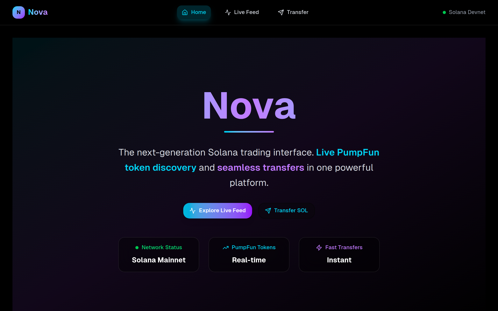
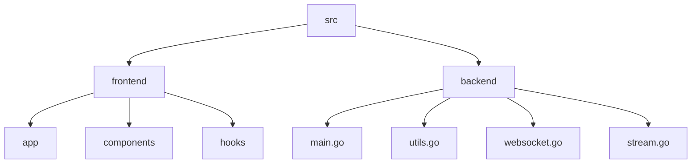

# Nova Sol: Real-Time Token Feed and WebSocket Server 🚀

## 🗂️ Description

Nova Sol is a full-stack application that provides a real-time token feed and WebSocket server for Solana blockchain data. The project consists of a Next.js frontend and a Go backend, connected through WebSocket technology. The application allows users to view live token data, search for specific tokens, and receive notifications. Developers can use this project as a starting point for building their own real-time data applications.

The project is designed for developers and users who want to stay up-to-date with the latest Solana blockchain data. The real-time token feed and WebSocket server provide a robust and scalable solution for applications that require live data.

## ✨ Key Features

* **Real-Time Token Feed**: View live token data from the Solana blockchain, including token prices, trading volumes, and other relevant information.
* **WebSocket Server**: Establish a WebSocket connection to receive real-time updates and notifications from the backend server.
* **Search and Filtering**: Search for specific tokens and filter the results based on various criteria.
* **Notifications**: Receive notifications for new token creations, updates, and other events.

The features can be grouped into the following categories:

* **Frontend Features**
	+ Real-time token feed
	+ Search and filtering
	+ Notifications
* **Backend Features**
	+ WebSocket server
	+ Solana blockchain data processing

## 🗂️ Folder Structure

## 🛠️ Tech Stack

## ⚙️ Setup Instructions

To run the project locally, follow these steps:

* Clone the repository: `git clone https://github.com/KnoxCodes/nova-sol.git`
* Install dependencies:
	+ Frontend: `cd frontend && npm install`
	+ Backend: `cd backend && go mod tidy`
* Start the backend server: `cd backend && go run main.go`
* Start the frontend development server: `cd frontend && npm run dev`

## 📦 GitHub Actions

The project uses GitHub Actions for continuous integration and deployment. The workflow is defined in the `.github/workflows/main.yml` file.

## 🔄 WebSocket Connection

The project establishes a WebSocket connection between the frontend and backend servers. The `useWebSocket` hook in the frontend handles the WebSocket connection and provides a way to send and receive messages.

## 📊 Solana Blockchain Data

The project processes Solana blockchain data using the Go backend server. The server connects to a Solana RPC endpoint and listens for new token pair creations on the PumpFun program. It processes incoming program logs, extracts creation events, and sends them to all connected clients via the WebSocket server.

    
